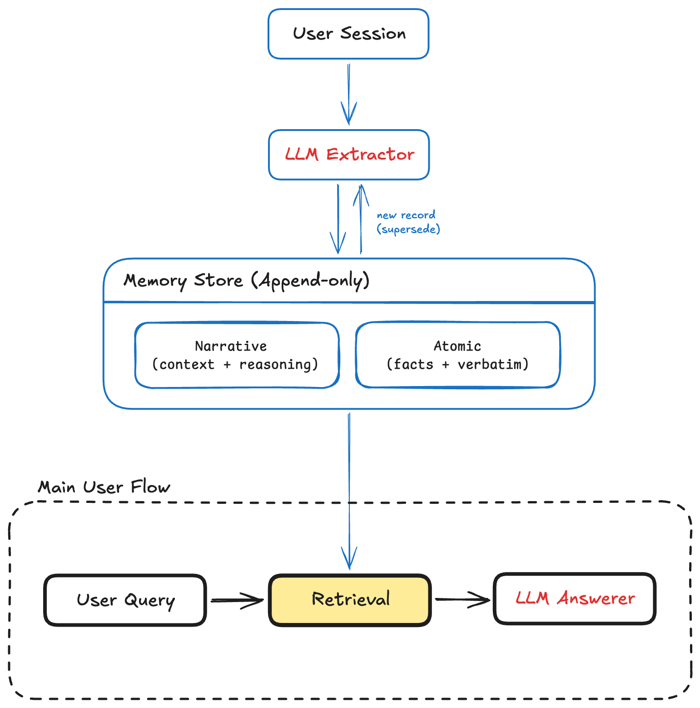

# Adaption-memory

Reproduction of Adaption Labs' **"Better Agent Memory Starts Before Retrieval"**
— <https://adaptionlabs.ai/blog/agent-memory-write-time>

> Bargav Jagatha (Modelling Resident) and Sudip Roy (Co-founder) — August 13, 2026

---

## The thesis

The bottleneck in agent memory is **not retrieval — it is what gets written**.
The highest-leverage optimization happens at write time, when information is
extracted into memory, not later when it is searched for.

### Why write time, not retrieval

The naive approach is to resend the full conversation history on every turn.
That makes cost a function of relationship length rather than question
difficulty — the tokens spent on a single turn come to track how long the agent
has known the user rather than how hard the current question is.

No retrieval strategy can recover a fact that was never extracted, or repair a
fact that was flattened into a lossy summary on the way in. Retrieval quality is
capped by write quality.

## Two memory representations

A single representation forces a bad trade: rich summaries lose exact values,
and exact values lose the reasoning around them. The system writes both.

| | Preserves | Good for |
|---|---|---|
| **Narrative memory** | causal context — the reasoning behind a decision or a change | *why* something is true, how a preference formed |
| **Atomic memory** | exact facts, the kind that has to survive verbatim | identifiers, numbers, names, dates, settings |

Retrieval draws on whichever the question needs.

## Evolutionary state tracking

Facts change. The system **defaults to appending** rather than overwriting or
deleting. When a value evolves, the new state is added and **marks what it
superseded**, so retrieval can favor what is true now while the earlier version
stays on record.

This is what makes knowledge-update and preference-change questions answerable:
the history of a fact is itself information.

## Benchmarks

The headline figures below are reported by the linked Adaption Labs article;
they are targets for this reproduction, not results produced by this checkout.

| Benchmark | Context size | Role |
|---|---|---|
| LongMemEval | ~5K tokens | multi-session baseline |
| LoCoMo | ~5K tokens | multi-session baseline |
| BEAM | ~100K tokens | long-conversation evaluation |

Baselines: **full-history inference** (whole conversation in the prompt) and a
**Mem0 OSS** reproduction run under an identical evaluation harness, with the
same answering model throughout.

### vs. full-history inference

| Metric | Result |
|---|---|
| LongMemEval accuracy | **90.6%** vs 60.6% |
| Tokens processed (long conversations) | **97% fewer** |
| Tokens processed (standard) | **57% fewer** |
| Mean latency | **45% lower** |
| p95 latency (long conversations) | **67% lower** |

### vs. Mem0 OSS

| Benchmark | Source approach | Mem0 OSS |
|---|---|---|
| LongMemEval | **90.6%** | 71.6% |
| LoCoMo | **88.2%** | 82.2% |
| BEAM | **61.3%** | 39.7% |
| Knowledge-update accuracy | **94.9%** | 75.6% |
| Preference retention | **96.7%** | 76.7% |

## Takeaway

Memory should *reduce* context, not accumulate it. Done right, it decouples
relationship length from inference cost — accuracy goes up while tokens and
latency go down — and that comes from representation choices made at write time,
not from retrieval sophistication alone.

## Status

The three eval harnesses and the first end-to-end write-time memory system are
built and tested. `--system adaptive` extracts narrative and atomic memory,
keeps superseded atomic states, and retrieves a bounded memory context for each
answer. `--system full-history` runs the article's baseline; `--system oracle`
echoes gold answers to validate the scoring plumbing.

The checkpointed overnight comparison is a separate production-shaped path in
`adaption_memory.memory`: append-only SQLite records, BGE-small + BM25 hybrid
retrieval, three extractor arms, a fixed Luna-none answerer and judge, atomic
spend tracking, signal split discipline, SFT preparation, and an HTML report.
Its canonical, actively maintained specification is
[`OVERNIGHT_PLAN.md`](OVERNIGHT_PLAN.md).

## Architecture



Every top-level concern is a separate module behind a small seam, so each can
be swapped or inspected on its own:

```
src/adaption_memory/
├── interface.py   # the seam: Session, Turn, MemorySystem protocol
├── llm.py         # OpenAI-compatible chat client (Ollama, LM Studio, OpenAI)
├── overnight.py   # smoke/signal-only checkpointed comparison CLI
├── memory/        # SQLite write path, hybrid read path, judge, SFT, report
├── systems/       # memory systems under test — register in REGISTRY
│   ├── adaptive.py     # narrative + atomic write-time memory
│   └── full_history.py # verbatim-history baseline
└── evals/         # one adapter per benchmark + shared runner plumbing
    ├── longmemeval.py, locomo.py, beam.py
    ├── mini.py    # deterministic smoke + signal preflight tier generator
    ├── common.py  # resumable JSONL plumbing
    └── run.py     # CLI; knows systems only via the registry
```

The dependency rule: benchmark adapters convert their data into `Session`s and
drive any `MemorySystem` through `reset` / `ingest` / `answer` / `usage` — they
never see a concrete system. Systems never see benchmark formats. Only the CLI
touches both, and only through `systems.REGISTRY`.

**To add a memory system:** implement the four-method protocol in
`interface.py`, drop the file in `systems/`, and add one line to `REGISTRY` in
`systems/__init__.py`. It is then runnable on all three benchmarks via
`uv run eval <bench> --system <your-name>` with no eval changes.

### Overnight plan runner

Put the hosted key in the gitignored `.env.local`; the runner reads it without
modifying the file:

```dotenv
OPENAI_API_KEY=your-key-here
```

The runner intentionally accepts only `smoke` and `signal`; there is no full
tier route. Outputs resume from per-input hashes under `results/overnight/`,
and every hosted call updates `results/spend.json` under a hard $40 cap.

```bash
uv run overnight-memory preflight
uv run overnight-memory run --tier smoke  --arm qwen3-4b-zeroshot
uv run overnight-memory run --tier smoke  --arm qwen3-4b-fewshot
uv run overnight-memory run --tier smoke  --arm luna-target
uv run overnight-memory run --tier signal --arm qwen3-4b-fewshot
uv run overnight-memory run --tier signal --arm luna-target --format F4 --split dev
# The first planned prompt optimization; writes to F4-dev-coverage.
uv run overnight-memory run --tier signal --arm luna-target --format F4 \
  --split dev --extractor-prompt coverage
uv run overnight-memory rescore-baselines
uv run overnight-memory build-sft --format F4 --extractor-prompt coverage
uv run overnight-memory report
```

The report is written to `report/index.html`, with every plotted value also in
`report/data/*.json`. `results/MORNING.md` is regenerated from the same data.
Qwen3-4B is the sole local extractor identity. The two bounded optimization
revisions, `coverage` and `validated`, are deliberately restricted to the
winning F4 representation. Each receives a distinct result path so
incompatible checkpoints are never silently reused.

**To add a benchmark:** write one adapter module in `evals/` that loads the
data, yields `Session`s, and scores answers; wire it into `run.py`.

### Adaptive system

Every ingested session makes one extraction call. The extractor writes causal
context as narrative records and exact values as atomic records. Atomic keys
are stable semantic identities: when a key receives a changed value, the new
record references the prior record's durable ID, is appended under the
canonical key, and the previous active record points to its replacement.
Nothing is overwritten or deleted. The active-state context supplied to later
extractions is bounded, while the append-only history remains available for
question-time retrieval.

Retrieval ranks both representations with bounded lexical matching, favors
active atomic facts, and falls back to a small recent-state window for
paraphrases with no token overlap. This deliberately keeps retrieval simple;
the write representation is the experiment.

Unambiguous `yesterday` event dates are resolved at write time against the
source session's timestamp across the three benchmark date formats. The
timestamp remains labeled as provenance, not as the event date.
High-confidence `when` questions return a strongly matched absolute-date atomic
directly, preserving the exact value without a second generative paraphrase.

Usage includes both extraction and answering calls. For LoCoMo and BEAM, where
one ingested conversation serves many questions, the one-time extraction cost
is attributed to the first answer and is not counted again on resumed runs.

## Running the evals

Data (gitignored, ~300MB total):

```
mkdir -p data && cd data
curl -LO https://huggingface.co/datasets/xiaowu0162/longmemeval-cleaned/resolve/main/longmemeval_s_cleaned.json
curl -LO https://huggingface.co/datasets/xiaowu0162/longmemeval-cleaned/resolve/main/longmemeval_oracle.json
curl -L  https://raw.githubusercontent.com/snap-research/locomo/main/data/locomo10.json -o locomo10.json
curl -L  https://huggingface.co/datasets/Mohammadta/BEAM/resolve/main/data/100K-00000-of-00001.parquet -o beam_100k.parquet
```

Run (answering model defaults to Ollama at `localhost:11434`, judge is any
OpenAI-compatible endpoint):

```
ollama pull qwen3:4b
uv run eval locomo      --system full-history --model qwen3:4b
uv run eval locomo      --system adaptive     --model qwen3:4b
uv run eval longmemeval --system full-history --judge-model gpt-5.6-luna
uv run eval beam        --system full-history --judge-model gpt-5.6-luna
```

For faster local checks, 1.7B exercises the complete memory path while 0.6B is
best treated as plumbing-only. Disable their reasoning trace to shorten each
structured extraction:

```
uv run eval locomo --system adaptive --model qwen3:1.7b --reasoning-effort none
uv run eval locomo --system adaptive --model qwen3:0.6b --reasoning-effort none
```

Strict JSON Schema is the default extraction contract. For an
OpenAI-compatible answer endpoint that only supports JSON mode, add
`--structured-output json-object`; if it supports neither structured-output
parameter, use `--structured-output prompt-only`. Omit `--reasoning-effort`
for endpoints that do not implement that optional parameter.

The verified temporal acceptance case ingests all 19 sessions from LoCoMo
sample `conv-26`, then answers its first question. Qwen3 4B returned the exact
gold date `7 May 2023` (F1 1.0) after relative-date normalization and strict
event-key matching. This is one deliberately difficult acceptance case, not a
claim about full-benchmark accuracy.

Stages are resumable (`--stage answer|judge|report|all`); full results land in
`results/<bench>/<system>/`, and preflight results add the tier before the
benchmark. Offline tests: `uv run pytest`.

### Local smoke and signal preflight tiers

Generate both preflight tiers for all three benchmarks from the downloaded
full datasets:

```
uv run make-mini
```

This writes native-format files and auditable selection manifests under
`data/mini/smoke/` and `data/mini/signal/`. Both tiers are deterministic and
cover all six LongMemEval question types plus abstention, all five LoCoMo
categories, and all ten BEAM memory abilities.

| Tier | Questions | Dataset size | Intended use |
|---|---:|---:|---|
| `smoke` | 22 | 479 KB | Very fast plumbing and major-regression check |
| `signal` | 90 | 7.99 MB | Repeated, distribution-aware model comparison before a full run |
| full | 2,886 | 285.62 MB | Official final reporting |

The signal tier uses 30 questions per benchmark. LongMemEval and LoCoMo track
the source category distribution subject to at least three examples per
stratum; their total-variation distances from the full category mixes are
0.0413 and 0.0567. BEAM is exactly balanced, matching its source distribution.
Five selected LoCoMo conversations and three selected BEAM conversations are
untrimmed. LongMemEval includes one untrimmed stress case per type and retains
41.2% of the source characters overall. Thus 66 of the 90 questions run against
full selected contexts, while the remaining LongMemEval cases preserve all
annotated support plus ten spread distractor sessions.

For the adaptive system, the generated signal data implies 836 answer-side
model calls before any judges: 746 session extractions plus 90 answers. That is
12.7 times the verified 66-call smoke path, and no signal wall-time baseline
has been measured yet. Treat signal as a pre-final comparison run, not the
per-change loop; use smoke for rapid iteration.

Run the smoke tier with isolated resumable outputs under `results/smoke/`:

```
uv run eval locomo      --tier smoke --system adaptive --model qwen3:1.7b --reasoning-effort none \
  --out results/smoke/locomo/adaptive-qwen3-1.7b
uv run eval longmemeval --tier smoke --system adaptive --model qwen3:1.7b --reasoning-effort none \
  --judge-model qwen3:1.7b --judge-base-url http://localhost:11434/v1 \
  --out results/smoke/longmemeval/adaptive-qwen3-1.7b
uv run eval beam        --tier smoke --system adaptive --model qwen3:1.7b --reasoning-effort none \
  --judge-model qwen3:1.7b --judge-base-url http://localhost:11434/v1 \
  --out results/smoke/beam/adaptive-qwen3-1.7b
```

For the stronger pre-final local signal, use the installed 4B answer model and
the direct-label 1.7B judge:

```
uv run eval locomo --tier signal --system adaptive --model qwen3:4b \
  --out results/signal/locomo/adaptive-qwen3-4b
uv run eval longmemeval --tier signal --system adaptive --model qwen3:4b \
  --judge-model qwen3:1.7b --judge-base-url http://localhost:11434/v1 \
  --judge-reasoning-effort none \
  --out results/signal/longmemeval/adaptive-qwen3-4b
uv run eval beam --tier signal --system adaptive --model qwen3:4b \
  --judge-model qwen3:1.7b --judge-base-url http://localhost:11434/v1 \
  --judge-reasoning-effort none \
  --out results/signal/beam/adaptive-qwen3-4b
```

Never point a signal run at a smoke result directory: provenance checks
deliberately reject cross-tier resumptions.

The 1.7B smoke commands are the daily iteration path. The signal commands use
4B for higher-quality answers while retaining 1.7B as the judge. This installed
4B template spends short judge budgets on a reasoning trace, while 1.7B honors
`none` and returns labels directly. Never reuse an output directory across
answer or judge configurations: resumability intentionally treats existing IDs
as complete.
Each result directory stores dataset and answer configuration fingerprints,
plus judge configuration where applicable, and rejects mismatched or
unverified resumptions.

For a faster, higher-quality hosted smoke preflight, [GPT-5.6 Luna](https://developers.openai.com/api/docs/models/gpt-5.6-luna)
supports structured outputs and a 1.05M-token context. Use `medium` for the
memory system and an independent `high` judge pass; this protects write quality
and scoring accuracy while keeping the cost/latency-oriented Luna tier
throughout:

```
export OPENAI_API_KEY=...  # keep this outside the repository
uv run eval locomo --tier smoke --system adaptive --model gpt-5.6-luna \
  --base-url https://api.openai.com/v1 --reasoning-effort medium --max-tokens 4096 \
  --out results/smoke/locomo/adaptive-luna-medium
uv run eval longmemeval --tier smoke --system adaptive --model gpt-5.6-luna \
  --base-url https://api.openai.com/v1 --reasoning-effort medium --max-tokens 4096 \
  --judge-model gpt-5.6-luna --judge-reasoning-effort high --judge-max-tokens 2048 \
  --out results/smoke/longmemeval/adaptive-luna-medium
uv run eval beam --tier smoke --system adaptive --model gpt-5.6-luna \
  --base-url https://api.openai.com/v1 --reasoning-effort medium --max-tokens 4096 \
  --judge-model gpt-5.6-luna --judge-reasoning-effort high --judge-max-tokens 2048 \
  --out results/smoke/beam/adaptive-luna-medium
```

Verified hosted preflight on 2026-08-24 with that configuration:

| Smoke benchmark | Directional score | Answer-side usage | Observed wall time |
|---|---:|---:|---:|
| LoCoMo | F1 0.4000 | 14 calls, 33,786 input, 11,842 output tokens | ~2 min |
| LongMemEval | accuracy 0.7143 | 32 calls, 89,848 input, 16,436 output tokens | ~3.4 min |
| BEAM | overall 0.4267 | 20 calls, 42,231 input, 9,482 output tokens | ~3.5 min |

The initial 1,024-token Luna extraction cap truncated structured memory and
reduced LoCoMo to 0.2000; 4,096 is therefore the eval default. Judge usage is
additional to the answer-side totals above.

The smoke scores are fast directional checks and must not be reported as
estimates of official full-benchmark performance. The signal tier is a more
stable comparison set, but 90 deterministic cases still do not provide a
confidence-bounded official-score estimate. Inspect `data/mini/manifest.json`
for the tier index and each tier's manifest for exact selected IDs, category
distance, source/retained context sizes, support records, and distractors.

### Fast extraction loop

Your own error analysis says most failures are facts never extracted, so the
inner loop scores extraction directly and skips answering and judging
entirely — a qwen-arm iteration costs zero hosted tokens:

```bash
uv run overnight-memory fastloop --arm qwen3-4b-zeroshot --benchmark locomo --limit 1
```

Sessions within a conversation are strictly sequential (each extraction sees
the store built by the previous ones), but conversations are independent, so
they run on a shared pool across benchmarks (`--workers`, default 3; measured
2.7x on the full smoke suite). Use the single-conversation form above (~100 s)
while iterating, and the full suite (all nine smoke conversations, ~22
scorable facts, `uv run overnight-memory fastloop --arm <arm> --workers 3`)
to confirm a prompt change before promoting it to a signal run.

It ingests smoke-tier conversations through the write path, then checks each
question's reference against (a) the whole store and (b) the retrieved top-k,
using the same strict recall proxy the signal runs report. Results land in
`results/fastloop/<arm>/<format>-<prompt>-<hash>/`: a `summary.json` with
`store_recall` / `retrieved_recall` / supersession / rejected counts, and a
`misses.jsonl` listing each missed fact with its bucket
(`fact_not_extracted` vs `stored_not_retrieved`) — the concrete list to
iterate the extractor prompt against.

The directory hash covers the resolved prompt, few-shot messages, and local
inference bounds: edit any of them and the next run starts clean in a new
directory; rerun unchanged and checkpoints make it near-instant. Promote a
prompt to a signal run only after it wins here.

### Scoring fidelity

Each harness reproduces its official scorer:

- **LongMemEval** — the verbatim judge prompts from `evaluate_qa.py`
  (per-type templates, abstention via `_abs`, label = "yes" in judge output).
- **LoCoMo** — the lexical metrics from `task_eval/evaluation.py`: stemmed
  token F1 (categories 2/3/4, category 3 takes the first `;`-field of gold),
  multi-answer partial F1 (category 1), abstention substring check (category 5).
  No judge model involved.
- **BEAM** — the official rubric scheme: every rubric item judged 0/0.5/1 with
  the verbatim unified judge prompt, averaged; `event_ordering` reported as
  normalized Kendall's tau over LLM-aligned event lists. One deliberate fix:
  we substitute the `<question>` placeholder the official runner leaves
  unreplaced.

## License

MIT — see [LICENSE](LICENSE).
